<p align="center">
  
</p>

# 🎬 Google Veo Prompt Collection

<a href="https://github.com/ishandutta2007/Awesome-Awesome-Awesome"></a><a href="https://discord.gg/jc4xtF58Ve"></a>
[](https://opensource.org/licenses/MIT)
[](http://makeapullrequest.com)
[](https://deepmind.google/models/veo/)
<a href="https://github.com/ishandutta2007"></a>

  

> [!NOTE]
> 📌 This collection has been merged with the [Ultimate Prompts Directory](https://github.com/SingularityLabs-ai/Ultimate_Prompts_Directory).

✨ Welcome to the **Google Veo Prompt Collection**! This repository is a curated library of high-quality, production-ready sample prompts designed for **Google's Veo text-to-video model** 🎥⚡. 

Whether you are a filmmaker 🎬, AI developer 💻, or digital artist 🎨, these prompts provide a solid foundation for generating cinematic, high-definition videos using state-of-the-art generative AI.

---

## 🚀 Quick Start

1. 🔍 **Browse** the [Prompt Library](prompts/).
2. 📋 **Copy** a prompt that fits your creative vision.
3. ⚡ **Generate** using [Vertex AI Studio](https://cloud.google.com/vertex-ai) or the [Gemini API](https://ai.google.dev/gemini-api/docs/video).

---

## 🧠 Why Google Veo?

Google Veo is a groundbreaking generative AI model by **Google DeepMind** 🌐 that translates natural language into high-quality video content. It supports:
- 🎥 **Cinematic Styles**: From film noir to sweeping aerial drone shots.
- 🌊 **Physics-Aware Motion**: Realistic fluid dynamics, smoke, collisions, and character movements.
- 📺 **High Resolution**: Crisp 1080p/4K details suitable for professional creative workflows.

---

## 🎭 Prompt Library

Explore our curated list of prompts across various genres in the [prompts/](prompts/) directory. For visual examples, check out the [Veo 3 Showcase](Veo3_Videos.md) 🍿.

### 🌟 Featured Prompts

| 🏷️ Name | 📝 Description | 📄 File |
| :--- | :--- | :--- |
| 🏙️ **Urban Sunrise** | A wide-angle shot of a bustling city skyline at sunrise. | [`Urban_Sunrise.txt`](prompts/Urban_Sunrise.txt) |
| 🕵️ **Rainy Street Noir** | Cinematic close-up of a detective in a rain-soaked alley. | [`Rainy_Street_Noir.txt`](prompts/Rainy_Street_Noir.txt) |
| 🧱 **LEGO Adventure** | Dynamic camera gliding through a miniature LEGO world. | [`Lego_Adventure.txt`](prompts/Lego_Adventure.txt) |
| 🦖 **Dinosaur Guitarist** | A dinosaur playing guitar at a waterside bar. | [`Dinosaur_Guitarist.txt`](prompts/Dinosaur_Guitarist.txt) |
| 🎤 **Rap Battle** | Isaac Newton vs Albert Einstein in a futuristic rap battle. | [`Rap_Battle_Newton_Einstein.txt`](prompts/Rap_Battle_Newton_Einstein.txt) |
| 🐨 **Breakdancing Koalas** | Humanoid koalas in a neon-lit urban dance battle. | [`Breakdancing_Koalas.txt`](prompts/Breakdancing_Koalas.txt) |
| 🧁 **Talking Muffins** | Two muffins having a conversation while baking. | [`Talking_Muffins.txt`](prompts/Talking_Muffins.txt) |
| 🚀 **Futuristic Market** | Sweeping drone shot of a vibrant, futuristic street market. | [`Futuristic_Market.txt`](prompts/Futuristic_Market.txt) |
| 🐕 **Playful Puppy** | Slow-motion close-up of a golden retriever puppy. | [`Playful_Puppy.txt`](prompts/Playful_Puppy.txt) |
| 🦒 **Giraffe NYC** | A giraffe pulling a wheelie on a dirt bike in NYC. | [`Giraffe_Dirt_Bike_NYC.txt`](prompts/Giraffe_Dirt_Bike_NYC.txt) |

👉 [View all prompts →](prompts/)

---

## 🛠️ Prompt Engineering Philosophy

Crafting the perfect video requires a balanced "Prompt Recipe" 🧪:

1. 🎯 **Subject**: The central focus (e.g., *a detective*, *a city skyline*).
2. 🎬 **Action**: What is happening? (e.g., *walking*, *docking*, *reflecting*).
3. 💡 **Style & Lighting**: (e.g., *Cinematic Noir*, *Golden Hour*, *Cyberpunk*).
4. 🎥 **Camera Mechanics**: (e.g., *Drone Shot*, *Close-up*, *Slow-motion*, *Panning*).

> 💡 **Pro Tip:** Use the **Veo Prompt Rewriter** in Vertex AI to automatically enrich your base prompts for even better results.

---

## 💻 Example API Usage (Python)

Integrate Veo into your applications using the `google-genai` SDK 🐍:

```python
import time
from google import genai
from google.genai import types

client = genai.Client()

operation = client.models.generate_videos(
    model="veo-2.0-generate-001",
    prompt="Cinematic close-up of a detective in a trench coat walking down a rain-soaked alley at night, neon lights reflecting on puddles.",
    config=types.GenerateVideosConfig(
        aspect_ratio="16:9",
    ),
)

while not operation.done:
    print("Generating video...")
    time.sleep(20)
    operation = client.operations.get(operation)

for n, generated_video in enumerate(operation.response.generated_videos):
    generated_video.video.save(f"veo_output_{n}.mp4")
```

---

## 🤝 Contributing

We love contributions! 💖 If you have a prompt that produces amazing results:
1. 🍴 Fork the repo.
2. ➕ Add your prompt to the list.
3. 🚀 Submit a Pull Request.

---

## 📜 License

Distributed under the **MIT License**. See [`LICENSE`](LICENSE) for more information. 📄

---

### 🔗 Related Resources
- 📖 [Official Veo Documentation](https://ai.google.dev/gemini-api/docs/video)
- 🎥 [Vertex AI Video Generation Guide](https://cloud.google.com/vertex-ai/generative-ai/docs/video/video-gen-prompt-guide)
- 🔬 [Google DeepMind: Veo](https://deepmind.google/models/veo/)

---
🏷️ *SEO Keywords: Google Veo, Text-to-Video AI, Video Prompt Engineering, Generative Video, AI Filmmaking, Vertex AI, DeepMind Veo.*


##  Star History
[](https://star-history.dera.page/#ishandutta2007/veo_prompts&type=date&legend=top-left)
